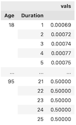

[](https://codecov.io/gh/actuarialopensource/pymort)

# pymort

`pymort` is a way to retrieve the mortality tables hosted at [https://mort.soa.org/](https://mort.soa.org/).

## Installation

Install pymort with `pip install pymort`.

## MortXML

If you want the full details of **any** SOA table, you can use the lower level `load` API. You just need to enter the table ID.

```py
from pymort import MortXML
# load the 2017 Loaded CSO Composite Gender-Blended 20% Male ALB table (tableId = 3282)
xml = MortXML.from_id(3282)
# you can load from a file path on your computer
xml_from_path = MortXML.from_path("t3282.xml")
# you can load from raw xml text
xml_str = Path("t3282.xml").read_text()
xml_from_str = MortXML(xml_str)
```

This `MortXML` class is a wrapper around the [underlying XML](https://mort.soa.org/About.aspx). The autocompletions you get on attributes improve the developer experience over using the underlying XML directly.


Also, mortality rate tables are Pandas DataFrames.




## Accessing mortality rates

For a select and ultimate table we can retrieve rates as follows.

```py
from pymort import MortXML
# Table 3265 is 2015 VBT Smoker Distinct Male Non-Smoker ANB, see https://mort.soa.org/ 
xml = MortXML.from_id(3265)
# This is the select table as a MultiIndex (age/duration) DataFrame.
xml.Tables[0].Values
# This is the minimum value of the issue age axis on the select table
xml.Tables[0].MetaData.AxisDefs[0].MinScaleValue
# This is the ultimate table as a DataFrame with index attained age.
xml.Tables[1].Values
```

## Usage with tensor libraries

We can get the data from Pandas to NumPy.

```py
select = MortXML.from_id(3265).Tables[0].Values.unstack().values
ultimate = MortXML.from_id(3265).Tables[1].Values.unstack().values

select.shape # (78, 25) ages from 18 to 95, duration from 1 to 25
ultimate.shape # (103,) is age 18 to 120

# Be careful when indexing into these, ultimate[0] is the rate at age 18!
```

