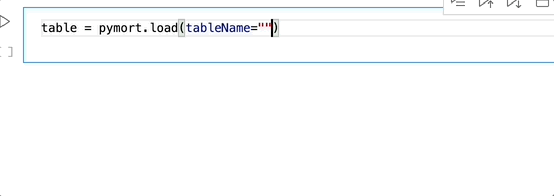

# pymort



`pymort` is a new way to retrieve the mortality tables hosted at [https://mort.soa.org/](https://mort.soa.org/). It leverage Python types to allow you to search for and retreive the desired tables. Use `ctrl+space` to see the available types in VS Code.

## Usage

### Accessing the tables

Install pymort with `pip install pymort`. Then you can import it and load a `table` (using autocompletion as shown in the gif above).

```
import pymort

table = pymort.load(tableName="2017 Loaded CSO Composite Gender-Blended 20% Male ALB - t3282")
```

### XTbML

`pymort.load` returns an instance of `XTbML`. XTbML is an XML standard for representing the tables at [mort.soa.org](https://mort.soa.org/), and the `XTbML` object is a Python class that mirrors the XML structure. At the bottom of the following code you can see the definition of the `XTbML` class. The attributes of the class are the children of the XML element. **Notice the Table class contains a pd.DataFrame, these are the rates!**. Use intellisense to navigate the class.

```py
@dataclass
class AxisDef:
    ScaleType: str
    AxisName: str
    MinScaleValue: int
    MaxScaleValue: int
    Increment: int

@dataclass
class MetaData:
    ScalingFactor: float
    DataType: str
    Nation: str
    TableDescription: str
    AxisDefs: List[AxisDef]

@dataclass
class Table:
    MetaData: MetaData
    Values: pd.DataFrame

@dataclass
class ContentClassification:
    TableIdentity: str
    ProviderDomain: str
    ProviderName: str
    TableReference: str
    ContentType: str
    TableName: str
    TableDescription: str
    Comments: str
    KeyWords: List[str]

@dataclass
class XTbML:
    ContentClassification: ContentClassification
    Tables: List[Table]
```
