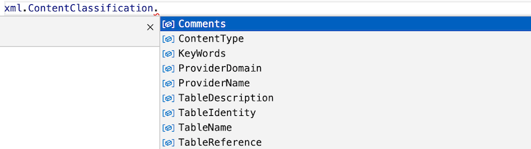
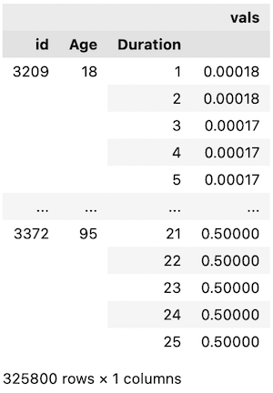
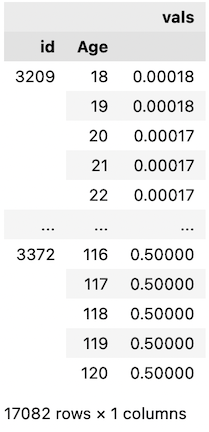
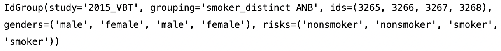

# pymort

`pymort` is a way to retrieve the mortality tables hosted at [https://mort.soa.org/](https://mort.soa.org/).

## Installation

Install pymort with `pip install pymort`.

## MortXML

If you want the full details of **any** SOA table, you can use the lower level `load` API. You just need to enter the table ID.

```py
from pymort import MortXML
# load the 2017 Loaded CSO Composite Gender-Blended 20% Male ALB table (tableId = 3282)
xml = MortXML(3282)
```

This `MortXML` class is a wrapper around the [underlying XML](https://mort.soa.org/About.aspx). The autocompletions you get on attributes improve the developer experience over using the underlying XML directly.



### Examples

```py
from pymort import MortXML
xml = MortXML(3265)
# This is the select table as a MultiIndex (age/duration) DataFrame.
xml.Tables[0].Values
# This is the minimum value of the issue age axis on the select table
xml.Tables[0].MetaData.AxisDefs[0].MinScaleValue
# This is the ultimate table as a DataFrame with index attained age.
xml.Tables[1].Values
```

## Usage with tensor libraries

Once we get the data from Pandas to NumPy it should be easy to get into JAX or any other tensor library.

```py
select = MortXML(3265).Tables[0].Values.unstack().values
ultimate = MortXML(3265).Tables[1].Values.unstack().values

select.shape # (78, 25) ages from 18 to 95, duration from 1 to 25
ultimate.shape # (103,) is age 18 to 120

# Be careful when indexing into these, ultimate[0] is the rate at age 18!
```

## Relational tables

Pymort provides **3 normalized tables** related by [primary/foreign keys](https://www.ibm.com/docs/en/ida/9.1.1?topic=entities-primary-foreign-keys), a design taken from relational databases.

Currently tables from 2015 VBT and 2017 CSO are supported. If you want support for tables from other studies, open an issue on GitHub.

XML files with multiple "select" (2-dimensional) or multiple "ultimate" (1-dimensional) tables like table [2636](https://mort.soa.org/ViewTable.aspx?&TableIdentity=2636) are not supported so that we can avoid adding another column.

### Metadata

Each table has a unique identifier called an `id`. There is information associated with this table like

- What is the name of the mortality study producing the table? (i.e. 2017 CSO vs. 2015 VBT)
- Is there a grouping that the table belongs to within the study? (i.e. unloaded preferred_structure gender_distinct ANB vs. loaded smoker_distinct gender_blended ALB)
- Gender (male vs. female)
- Risk (smoker vs. nonsmoker)

We call this information about a table the `metadata` and store it as an attribute of our `Relational` object.

```py
from pymort import Relational

db = Relational()

print(db.metadata)
```


### Select

Select tables depend on the issue age, and the years since issuing the contract.

```py
print(db.select)
```



### Ultimate

Ultimate tables depend on the attained age only.

```py
print(db.ultimate)
```



### Groupings

If you want to get the IDs for all tables having the same study and group there is a function for this, although you could do it yourself in Pandas.

```py
from pymort import getIdGroup

getIdGroup(3265)
```

This returns a dataclass representing the grouping.


